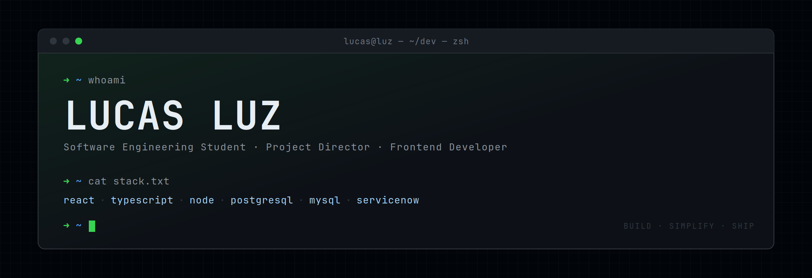

<p align="center">
  
</p>

```console
lucas@luz:~$ whoami
```
```
┌────────────────────────────────────────────────────────────────┐
│  LUCAS LUZ                                                     │
│  Software Engineering Student · Project Director · Frontend Dev │
├────────────────────────────────────────────────────────────────┤
│  > I build interfaces, automate workflows,                     │
│    and enjoy making complex things simpler.                    │
└────────────────────────────────────────────────────────────────┘
```

```console
lucas@luz:~$ cat about.txt
```
```
role      : Project Director @ frontend development
studying  : Software Engineering
focus     : clean, functional and responsive interfaces
learning  : TypeScript (backend), PostgreSQL, MySQL
platform  : ServiceNow workflows & governance
offline   : fitness · music · current events
```

```console
lucas@luz:~$ ls -1 ~/builds/
```
```
drwxr-xr-x  responsive-accessible-frontends/
drwxr-xr-x  component-driven-uis/
drwxr-xr-x  database-driven-apps/
drwxr-xr-x  servicenow-workflows/
drwxr-xr-x  automation-scripts/
```

```console
lucas@luz:~$ cat stack.json
```
```json
{
  "frontend": ["React", "TypeScript", "HTML", "CSS"],
  "backend":  ["TypeScript", "Node"],
  "data":     ["PostgreSQL", "MySQL"],
  "platform": ["ServiceNow"],
  "tools":    ["Git", "Vercel"]
}
```

```console
lucas@luz:~$ ./progress.sh
```
```
frontend architecture & design systems   [██████████░░░░░░░░░░]  50%
typescript for backend                   [████████░░░░░░░░░░░░]  40%
servicenow advanced features             [██████████████░░░░░░]  70%
database design & sql optimization       [████████████░░░░░░░░]  60%
leadership & project management          [████████████████░░░░]  80%
```

```console
lucas@luz:~$ cat contact.cfg
```
```ini
email     = lucaspmluz@hotmail.com
linkedin  = /in/lucas-luz-1b0258324
portfolio = portifolio-mu-one-80.vercel.app
```

<p align="center">
  <a href="mailto:lucaspmluz@hotmail.com">Email</a> •
  <a href="https://www.linkedin.com/in/lucas-luz-1b0258324/">LinkedIn</a> •
  <a href="https://portifolio-mu-one-80.vercel.app/">Portfolio</a>
</p>

```console
lucas@luz:~$ echo $MOTTO
"I like building things that are useful, efficient, and actually make life easier."

lucas@luz:~$ _
```
